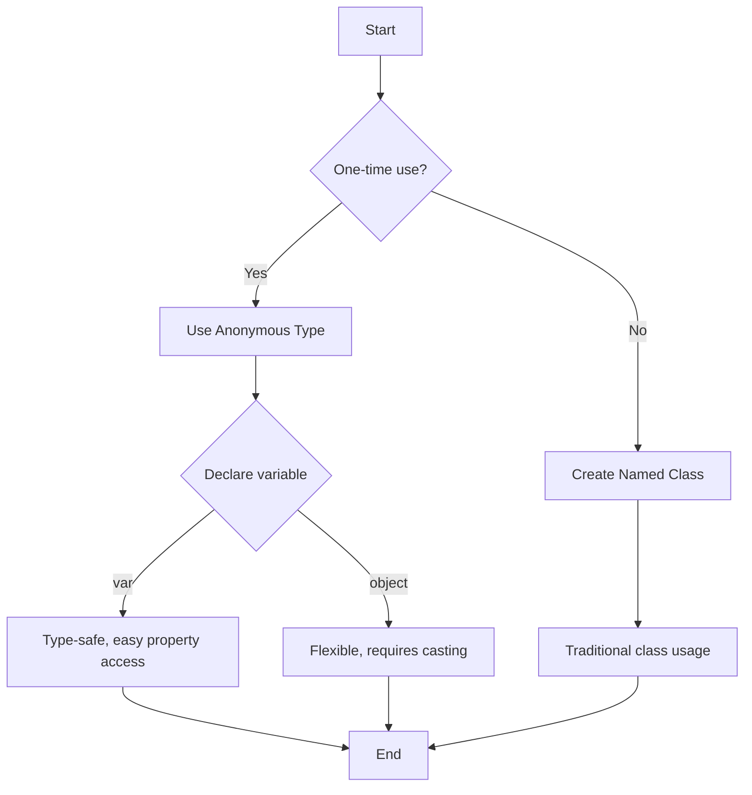

# C# Advanced Concepts: Anonymous Types, var, and dynamic

## Table of Contents
1. [Implicit Type Local Variable (var and dynamic)](#implicit-type-local-variable)
2. [Extension Methods](#extension-methods)
3. [Anonymous Types](#anonymous-types)
4. [Using object vs var for Anonymous Types](#using-object-vs-var-for-anonymous-types)


## Implicit Type Local Variable

Before diving into LINQ, it's important to understand three key features. The first one is implicitly typed local variables, introduced through the keywords `var` and `dynamic`.

### The var Keyword

The `var` keyword allows you to define local variables without explicitly specifying their data type. The compiler infers the type based on the initial value assigned to the variable.

#### Key Points:

1. **Local Variable Definition**: 
   - Traditional: Explicitly specify the data type
   - With `var`: Let the compiler infer the type
   
   ```csharp
   // Traditional
   string Data = "Ahmed";
   
   // Using var
   var Data = "Ahmed"; // Implicit Type
   ```

2. **Type Inference**:
   - The compiler detects the data type based on the initial value
   - Once inferred, the type is fixed

3. **Initialization Requirements**:
   - `var` must be initialized at declaration
   - Cannot be initialized with `null`
   
   ```csharp
   var x = null; // Invalid
   var y; // Invalid - must be initialized
   ```

4. **Type Safety**:
   - After initialization, you can't change the variable's data type
   
   ```csharp
   var Data = "Ahmed";
   Data = null; // Valid - null is allowed for reference types
   Data = 5; // Invalid - can't assign int to a string variable
   ```

5. **Value Changes**:
   - The value can be changed, but must match the inferred type
   
   ```csharp
   var Data = "Ahmed";
   Data = "Mai"; // Valid - new value matches the inferred type (string)
   ```

#### Benefits of using `var`:
- Reduces code verbosity
- Useful with anonymous types
- Helpful when the type is obvious from the right side of the assignment

#### Limitations:
- Can make code less readable if overused
- Not suitable for public API signatures

### The dynamic Keyword

`dynamic` is used when you want the type to be determined at runtime.

#### Key Points:
- Type is determined at runtime
- Can change type after initialization
- Can be declared without initialization
- Can be initialized with `null`
- Allows for more flexible but less safe code

#### Usage Examples:
```csharp
dynamic data = "Ali";
data = 5;
data = true;
data = 3.3;
data = 'A';

dynamic x;  // Valid, can be declared without initialization
dynamic y = null;  // Valid, can be initialized with null
```

### Comparing var and dynamic

| Feature | var | dynamic |
|---------|-----|---------|
| Type Detection | Compile-time | Runtime |
| Type Changes | Not allowed | Allowed |
| Null Initialization | Not allowed | Allowed |
| Usage Scope | Local variables only | More flexible |
| Error Detection | Compile-time | Runtime |

#### Recommendations:
- `var` is generally recommended for better performance and earlier error detection
- Use `var` when the type is obvious from the right side of the assignment
- Use `dynamic` when working with COM objects or when type is truly unknown until runtime

#### Error Handling Example:
```csharp
var x = null;  // Compilation Error
dynamic y = null;
Console.WriteLine(y);  // No compilation error, but throws RuntimeBinderException
```

## Extension Methods

Extension methods allow you to add new methods to existing types without modifying the original type. This is particularly useful for adding functionality to types you can't modify, such as built-in types or types from third-party libraries.

### Creating Extension Methods

To create an extension method:

1. Define a static class to contain the extension method(s).
2. Create a static method with the first parameter using the `this` keyword, followed by the type you're extending.
3. The `this` parameter represents the instance the method will be called on.

### Example: Reversing Numbers

Let's create an extension method to reverse integers:

```csharp
public static class IntExtension
{
    public static int Reverse(this int number)
    {
        int reversedNumber = 0;
        while (number != 0)
        {
            int reminder = number % 10;
            reversedNumber = reversedNumber * 10 + reminder;
            number /= 10;
        }
        return reversedNumber;
    }
}
```

Usage in main:

```csharp
int x = 12345;
int y = x.Reverse();
Console.WriteLine(y); // Outputs: 54321
```

### Generalizing Extension Methods

To make the extension method work with multiple numeric types, we can use interfaces. For example, `IComparable` is implemented by most numeric types:

```csharp

    private static int ReverseInteger(int number)
    {
        int reversedNumber = 0;
        while (number != 0)
        {
            int reminder = number % 10;
            reversedNumber = reversedNumber * 10 + reminder;
            number /= 10;
        }
        return reversedNumber;
    }

    private static long ReverseLong(long number)
    {
        long reversedNumber = 0;
        while (number != 0)
        {
            long reminder = number % 10;
            reversedNumber = reversedNumber * 10 + reminder;
            number /= 10;
        }
        return reversedNumber;
    }
}
```

Usage:

```csharp
int x = 12345;
long z = 1115466448489;

Console.WriteLine(x.Reverse()); // Outputs: 54321
Console.WriteLine(z.Reverse()); // Outputs: 9848446645111
```

Key Points:
- Extension methods must be defined in static, non-generic classes.
- The `this` keyword before the first parameter makes it an extension method.
- Extension methods appear as instance methods on the extended type.
- They can be used to add functionality to interfaces, allowing for more generic extensions.

## Anonymous Types

Anonymous types in C# provide a convenient way to encapsulate a set of read-only properties into a single object without having to explicitly define a type first.

### Creating an Anonymous Type

Instead of creating a class for one-time use:

```csharp
internal class Employee
{
    public int Id { get; set; }
    public string Name { get; set; }
    public decimal Salary { get; set; }
}

Employee Emp01 = new Employee() { Id = 10, Name = "Aya", Salary = 10_000 };
```

We can use an anonymous type:

```csharp
var Emp01 = new { Id = 10, Name = "Aya", Salary = 10_000 };
```

### Characteristics of Anonymous Types

1. **Immutable**: Objects created from anonymous types are read-only.
   ```csharp
   // Emp01.Salary = 20_000; // Invalid
   ```

2. **Type Name**: The compiler generates a unique name for each anonymous type.
   ```csharp
   Console.WriteLine(Emp01.GetType().Name); // Output: <>f__AnonymousType0`3
   ```

3. **ToString() Override**: Anonymous types have a custom ToString() implementation.
   ```csharp
   Console.WriteLine(Emp01); // Output: { Id = 10, Name = Aya, Salary = 10000 }
   ```

### Creating New Instances

Before C# 10:
```csharp
var Emp02 = new { Emp01.Id, Emp01.Name, Salary = 20_000 };
```

C# 10 and later:
```csharp
var Emp03 = Emp01 with { Salary = 20_000 };
```

### Type Equality and Differences

Anonymous types are considered the same type if they have:
1. Same property names (case-sensitive)
2. Same property order

```csharp
var Hamda = new { Id = 20, Name = "Hamda", Salary = 200 };
Console.WriteLine(Hamda.GetType().Name); // Same as Emp01's type name

var Emp05 = new { Id = 20, Name = "Mona" };
Console.WriteLine(Emp05.GetType().Name); // Different from Emp01's type name
```

In the case of `Emp05`, a new anonymous type is created because it has a different set of properties compared to `Emp01` and `Hamda`. The compiler generates a new type name for this structure.

## Using object vs var for Anonymous Types

While `var` is commonly used for anonymous types, you can also use `object`. However, there are important differences to consider:

```csharp
object objEmp = new { Id = 10, Name = "Aya", Salary = 10_000 };
var varEmp = new { Id = 10, Name = "Aya", Salary = 10_000 };

// Using var
Console.WriteLine(varEmp.Salary); // Works fine

// Using object
// Console.WriteLine(objEmp.Salary); // Compile-time error
Console.WriteLine((objEmp as dynamic).Salary); // Works, but loses compile-time type checking
```

Using `var`:
- Provides compile-time type checking
- Allows direct access to properties
- Infers the correct anonymous type

Using `object`:
- Loses compile-time type checking
- Requires casting or use of `dynamic` to access properties
- More flexible but less type-safe

In general, `var` is preferred for anonymous types as it provides better type safety and easier property access.

## GetType() Method

The `GetType()` method, inherited from `object`, returns the type of an object:

```csharp
int x = 5;
Console.WriteLine(x.GetType().Name); // Output: Int32
```

## Mermaid Diagram: Anonymous Type Creation Process




